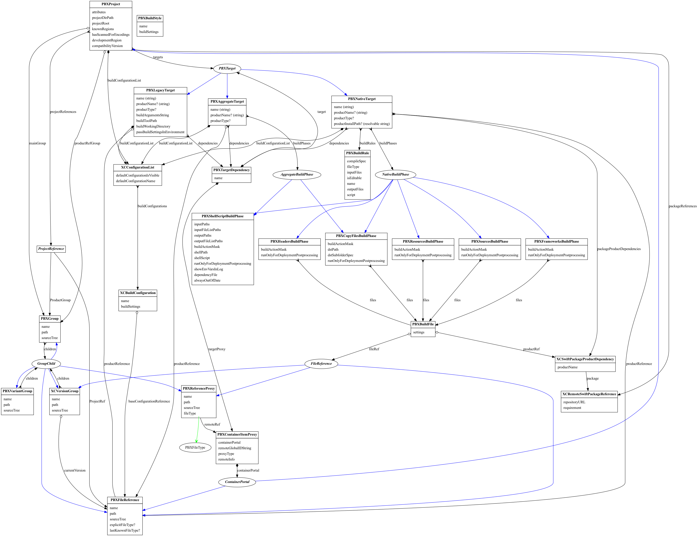
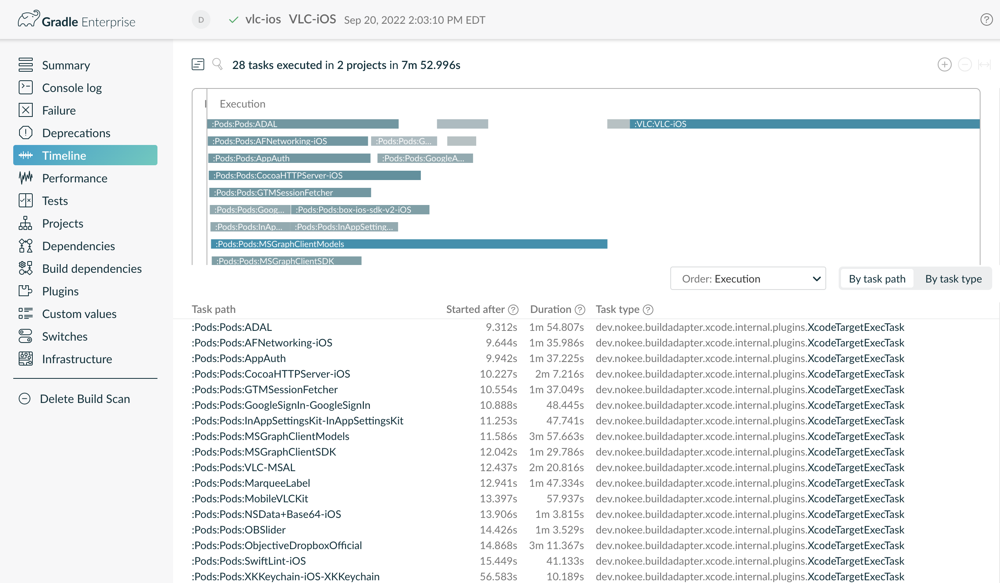

:idprefix:
:icons: font
:encoding: utf-8
:lang: en-US
:sectanchors: true
:sectlinks: true
:linkattrs: true
:jbake-permalink: devlog-6
:jbake-id: {jbake-permalink}
= Devlog #6
Daniel Lacasse
2022-09-20
:jbake-type: blog_post
:jbake-status: published
:jbake-tags: devlog
:jbake-description: Development log #6
:jbake-twitter: { "creator": "@lacasseio" }

:ref-xcode-model-graph: https://github.com/nokeedev/gradle-native/blob/master/subprojects/xcode-ide-kit/src/docs/pbxproj.dot
:ref-adhoc-artifact-repository: https://github.com/nokeedev/gradle-native/pull/708

This week's development log (devlog) is a three-for-one special and includes work done since the link:/devlog-5/[last devlog], published a while ago.
We split our primary development time between improvement to the language source set model, and the Xcode build adapter.

== Language Source Set Improvements

For a while now, we had two competing `LanguageSourceSet` implementations.
When we first introduced the concept, our chosen design focused on declaring the sources and headers.
We borrow some ideas from the software model core plugins.
The models were single bags of files that didn't correctly represent reality and didn't allow for ad-hoc declaration of source sets.
The second concept initially introduced in the JNI library plugin focuses on software composition.
In short, declaring a `LanguageSourceSet` implied the sources, their headers, a compile task, and consumable dependencies.
We can use the source set alone to create object files or as part of a more complex hiearchy such as an executable binary.
Thanks to our universal model, we can clearly define the owner and simple rules that will automatically complete native components with the right source set.
The last part is much more complicated than it seems.

== Xcode Build Adapter Improvements

As we onboarded more real-life projects with our Xcode build adapter plugin, it became clear that support for cross-project dependencies was necessary.
Previously, we only supported implicit dependencies via Xcode workspace.
We took a step back and made a deeper analysis of our Xcode model which led to the following graph footnote:[We are developing the link:{ref-xcode-model-graph}[graph] organically based on the development need.]:

.PBXProj models and relationships

One thing that stands out from our research is how simple yet powerful the Xcode build system is.
We need a stellar understanding of Xcode to ensure proper up-to-date checking, caching and parallelization.

The first step was to deserialize cross-project reference from the PBXProj properly.
It allows us to understand cross-project dependencies and remote product references (e.g. file references declared in another project).
Then, we perform an additional discovery step during configuration to find the effective list of Xcode projects participating in the build.
Finally, we use the Gradle dependency engine to process project dependencies (implicit, explicit and cross-project).

This small change to how we handle Xcode projects allows for deeper insight into the build process via build scan:

.Build scan of vlc-ios project
[link=https://scans.gradle.com/s/xgn7sfgn7ykya/timeline]

As we can see, all targets are independent, even if they come from the same project.
Previously all targets of a single project were treated as a single cluster.
To successfully break down target clusters, we preprocess the Xcode project before delegating the build to `xcodebuild`.
Thanks to the simplicity of the Xcode build system, we can trick Xcode into consuming our previously built products as part of a different and independent invocation.

Our next focus will be improving the configuration of Gradle's superior up-to-date check by extracting more accurate information from Xcode projects.

== Ad-hoc Artifact Repositories

Our plugins still rely on core native support in Gradle to discover and locate native toolchains.
It isn't ideal for us, given our lack of control over such critical infrastructure.
For a long while, we had a plan to select native toolchains (and system libraries) using the Gradle dependency engine.
Recently, link:{ref-adhoc-artifact-repository}[we pushed the first part of this plan which introduces the concept of ad-hoc artifact repositories].
They are on-disk Maven repositories with a twist!
The repository provides callbacks to generate the repository's content before completing the resolution.
We did countless experiments, and this solution was by far the simplest.
We still rely on internal Gradle APIs, so we don't expect users to interact directly with those repositories.
However, it marks the first step toward better native dependency management (including Conan support).
We already migrated our macOS framework dependency support from the dreadful embedded Jetty server to an ad-hoc repository.
