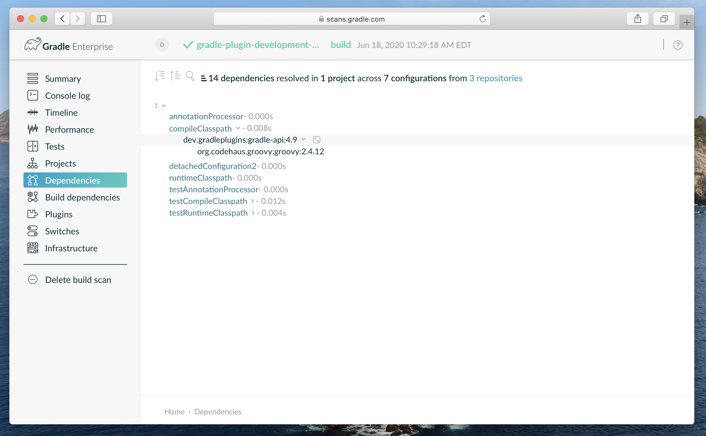
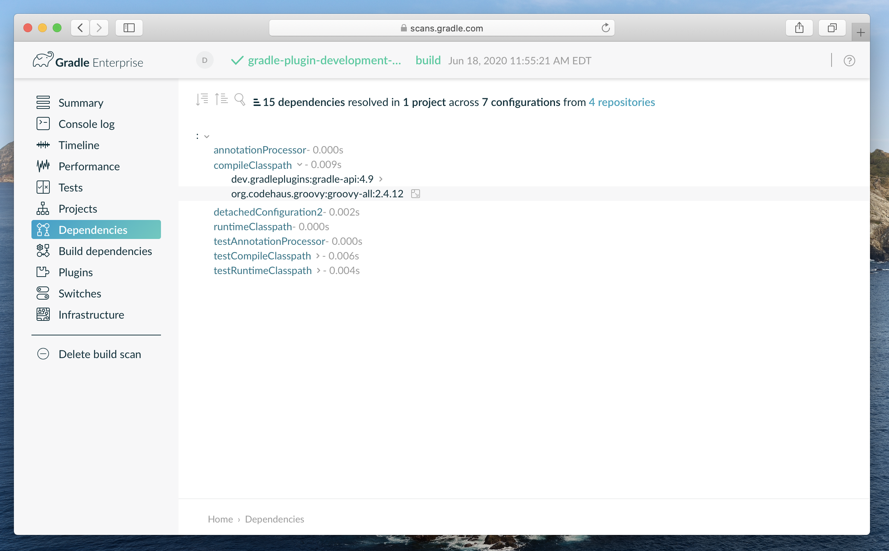
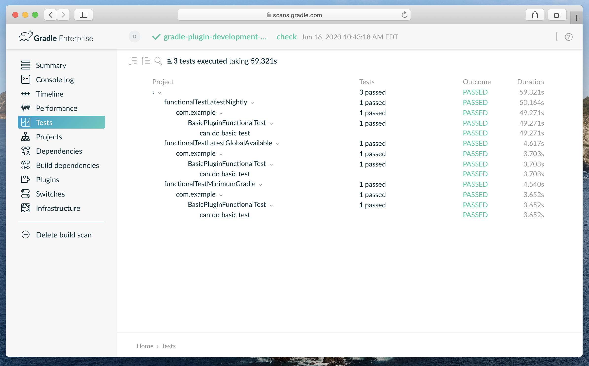

:idprefix:
:icons: font
:encoding: utf-8
:lang: en-US
:sectanchors: true
:sectlinks: true
:linkattrs: true
:jbake-permalink: introducing-gradle-toolbox
:gradle-user-manual: https://docs.gradle.org/6.2.1/userguide
:gradle-language-reference: https://docs.gradle.org/6.2.1/dsl
:gradle-api-reference: https://docs.gradle.org/6.2.1/javadoc
:gradle-guides: https://guides.gradle.org/
:jbake-id: {jbake-permalink}
= Introducing Gradle Plugin Toolbox
Daniel Lacasse
2020-06-22
:jbake-type: blog_post
:jbake-status: published
:jbake-tags: blog
:jbake-description: Introducing new plugins to help developing Gradle plugins.
:jbake-leadimage: announcement-toolbox-small.png
:jbake-leadimagealt: Gradle Plugin Toolbox Announcement
:jbake-twitter: { "creator": "@lacasseio", "card": "summary_large_image" }

The Gradle plugin development process is tedious.
Writing a simple plugin is somewhat acceptable; however, very painful when developing complex plugins.
The Nokee team is glade to officially unveil a toolbox to enhance the task at hand.

== Releasing new Gradle plugins

Today, we are announcing five plugins to improve the Gradle plugin development process:

https://nokee.dev/docs/nightly/manual/java-gradle-plugin-plugin.html[`dev.gradleplugins.java-gradle-plugin`]::
Provides support for developing Gradle plugin implemented in Java.
https://nokee.dev/docs/nightly/manual/groovy-gradle-plugin-plugin.html[`dev.gradleplugins.groovy-gradle-plugin`]::
Provides support for developing Gradle plugin implemented in Groovy.
https://nokee.dev/docs/nightly/manual/gradle-plugin-development-plugin.html[`dev.gradleplugins.gradle-plugin-development`]::
Provides additional support for developing Gradle plugin-related projects.
https://nokee.dev/docs/nightly/manual/gradle-plugin-unit-test-plugin.html[`dev.gradleplugins.gradle-plugin-unit-test`]::
Provides support for unit testing Gradle plugins.
https://nokee.dev/docs/nightly/manual/gradle-plugin-functional-test-plugin.html[`dev.gradleplugins.gradle-plugin-functional-test`]::
Provides support for functional testing Gradle plugins.

The first two plugins are a welcome alternative for the `java-gradle-plugin` core plugin and focus on Java and Groovy language, respectively.
The Kotlin ecosystem is a bit particular due to some _workarounds_(hacks) in Gradle itself.

The third plugin provides conveniences to projects supporting the development of Gradle plugins.
It's a settings plugin and decorates all projects.
The plugin provides conveniences for adding Gradle API dependencies of a specific version, querying compatibility information for released Gradle distribution, and adding dependencies on Gradle fixtures for testing maintained by Nokee.
Have a look at the https://nokee.dev/docs/nightly/samples/gradle-plugin-development-runtime-compatibilities/[Gradle runtime compatibility sample] to learn more.

The final two plugins formalize https://nokee.dev/docs/nightly/manual/gradle-plugin-development.html#sec:gradle-dev-unit-testing[unit] and https://nokee.dev/docs/nightly/manual/gradle-plugin-development.html#sec:gradle-dev-functional-testing[functional] testing for Gradle plugin development.
Typically, unit tests focus on individual classes using the `ProjectBuilder` testing fixtures.
On the other hand, functional tests focus on execution behaviours using the Gradle TestKit testing fixtures.

=== Why replace the core Gradle development plugins?

The core Gradle development plugins, e.g. `java-gradle-plugin` released as part of the Gradle distribution, are unfavorable to a fast iterative process.
We have seen little improvement catering to the Gradle plugin development experience despite a need for key features to aid high-quality plugin development.

== Features

=== Developing under a specific Gradle version while building with another

Modelling the minimum Gradle version supported by the plugins is an essential use case solved by the toolbox; instead of runtime errors Gradle will automatically detect the errors at compile-time by using the https://nokee.dev/docs/nightly/samples/gradle-plugin-development-with-minimum-gradle-version/[correct Gradle API JAR regardless of the running Gradle version].

.Configuring minimum supported Gradle
====
[.multi-language-sample]
=====
.build.gradle
[source,groovy]
----
gradlePlugin {
   compatibility {
      minimumGradleVersion = '4.9'
   }
}
----
=====
[.multi-language-sample]
=====
.build.gradle.kts
[source,kotlin]
----
gradlePlugin {
   compatibility {
      minimumGradleVersion.set("4.9")
   }
}
----
=====
====

Nokee published the generated Gradle API's JAR from each distribution together with its matching sources.
Additionally, we included it's correct Groovy/Kotlin runtime version as dependencies.
We've written a utility class to map the different Gradle versions to it's appropriate JVM runtimes; Java, Groovy, Kotlin.

=== Improving compatibility defaults

Our plugins select Gradle's source and target compatibility based on the minimum supported Gradle version of your plugins.
The plugins still allows you to overwrite Java compatibility as you typically would.

The same process applies to the Groovy runtime dependency as shown by the build scan.

By applying the `dev.gradleplugins.gradle-plugin-development` plugin in your settings script, you will have access to the `GradleCompatibility` class, used by our plugins' automatic compatibility selection, from every project.

.Querying Gradle compatibility information
====
[.multi-language-sample]
=====
.settings.gradle
[source,groovy]
----
plugins {
    id 'dev.gradleplugins.gradle-plugin-development' version '1.0.0'
}
----
.build.gradle
[source,groovy]
----
import static dev.gradleplugins.GradleCompatibility.*

tasks.register('gradleCompatibility') {
    def gradleVersion = '4.9'
    doLast {
      println "=== Gradle ${gradleVersion} Compatibility Information ==="
      println "Minimum Java version: ${minimumJavaVersionFor(gradleVersion)}"
      println "Groovy version: ${groovyVersionOf(gradleVersion)}"
      println "Kotlin version: ${kotlinVersionOf(gradleVersion).orElse('N/A')}"
    }
}
----
=====
[.multi-language-sample]
=====
.settings.gradle.kts
[source,kotlin]
----
plugins {
    id("dev.gradleplugins.gradle-plugin-development") version("1.0.0")
}
----
.build.gradle.kts
[source,kotlin]
----
import dev.gradleplugins.GradleCompatibility.*

tasks.register("gradleCompatibility") {
    val gradleVersion = "4.9"
    doLast {
      println("=== Gradle ${gradleVersion} Compatibility Information ===")
      println("Minimum Java version: ${minimumJavaVersionFor(gradleVersion)}")
      println("Groovy version: ${groovyVersionOf(gradleVersion)}")
      println("Kotlin version: ${kotlinVersionOf(gradleVersion).orElse("N/A")}")
    }
}
----
=====
====

=== Testing strategies

Plugin testing is the most important shortcoming in Gradle plugin development.
Unfortunately, writing tests are the only way to ensure high-quality plugins.
Our plugins support test coverage across several Gradle versions.
As part of this release, we include three common testing strategies: minimum supported Gradle version, latest released Gradle, and latest nightly.
Have a look at the https://nokee.dev/docs/nightly/samples/gradle-plugin-development-with-testing-strategies/[testing strategies sample] to learn more.

You can select the testing strategy from IntelliJ.

image::testing-strategies-inside-idea.png[Idea windows showing how to select a specific testing strategy]

Extracted from the Gradle codebase, our plugins offer complementary test fixtures for common assertions, e.g. content of archives, files, Maven repositories.
These test fixtures work in tandem with those provided by the Gradle team and already available: `ProjectBuilder` and Gradle TestKit.
An early preview is https://nokee.dev/docs/nightly/manual/gradle-plugin-development.html#sec:gradle-dev-gradle-fixtures[now available for trial], and https://github.com/gradle-plugins/toolbox/issues[your feedback] will help us prioritize future release features.

=== Generate Groovydoc JAR

Our Groovy development plugin enables the creation and publication of the Groovydoc JAR via the `groovy` extension on `gradlePlugin`.
It automatically registers the Groovydoc JAR as an outgoing artifact for the project.
Gradle will then publish the JAR side-by-side with your other plugin artifacts.

.Creating Groovydoc JAR for Gradle plugins
====
[.multi-language-sample]
=====
.build.gradle
[source,groovy]
----
plugins {
    id 'dev.gradleplugins.groovy-gradle-plugin' version '1.0.0'
}

gradlePlugin {
    groovy {
        withGroovydocJar()
    }
}
----
=====
[.multi-language-sample]
=====
.build.gradle.kts
[source,kotlin]
----
plugins {
    id("dev.gradleplugins.groovy-gradle-plugin") version("1.0.0")
}

gradlePlugin {
    groovy {
        withGroovydocJar()
    }
}
----
=====
====

== What's next?

https://nokee.dev/docs/nightly/samples/#sec:samples-gradle-dev[Try], share, https://github.com/nokeedev/gradle-native/issues[exchange your ideas and suggestion].
The Nokee team is eagerly awaiting your feedback!

We have a lot more features to come soon!
Please vote for your favourite to help us prioritize which feature to deliver first in our next release.

https://github.com/gradle-plugins/toolbox/issues/8[Add compatibility information to the JAR plugin]::
Help diagnose incompatible plugins in future releases.
https://github.com/gradle-plugins/toolbox/issues/9[Helpful runtime message for incompatible environments]::
Improve user experience and promote plugin adoptions.
https://github.com/gradle-plugins/toolbox/issues/10[Improve the modularization of the Gradle fixtures]::
Use the Gradle fixtures with any testing framework.
https://github.com/gradle-plugins/toolbox/issues/11[Allow testing strategy for specific Gradle version]::
Offer more coverage options to plugin authors.
https://github.com/gradle-plugins/toolbox/issues/12[Add cross-JVM testing strategies]::
Improve the plugin testing coverage across JDKs.
https://github.com/gradle-plugins/toolbox/issues/13[Formalize well-behaving test suite for tasks and plugins]::
Ensure a baseline quality for all plugins.
https://github.com/gradle-plugins/toolbox/issues/14[Support low-ceremony plugin development]::
Quick and easy creation of plugins by removing the majority of a plugin project setup steps.

link:#disqus_thread[Leave a comment below], write us on the https://gradle-community.slack.com/[Gradle community Slack] or email us at hello@nokee.dev.
