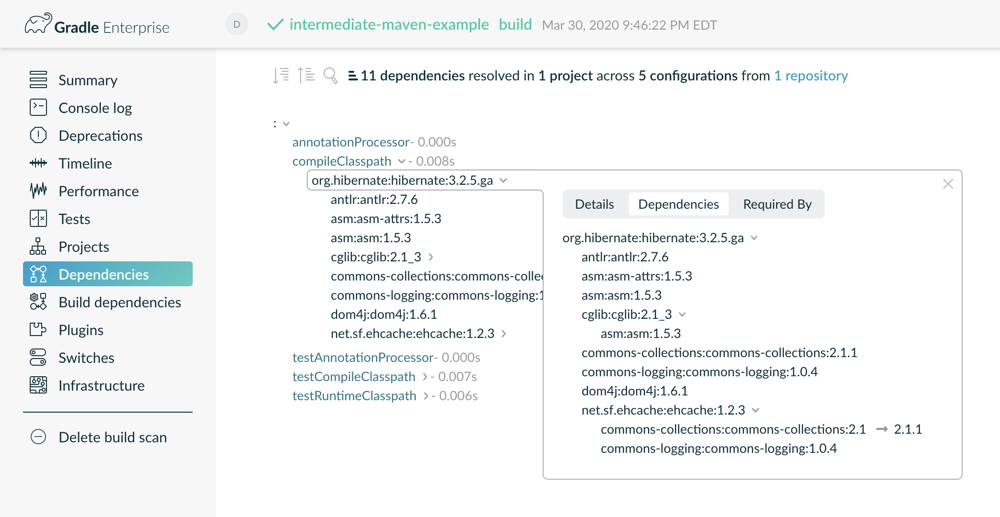
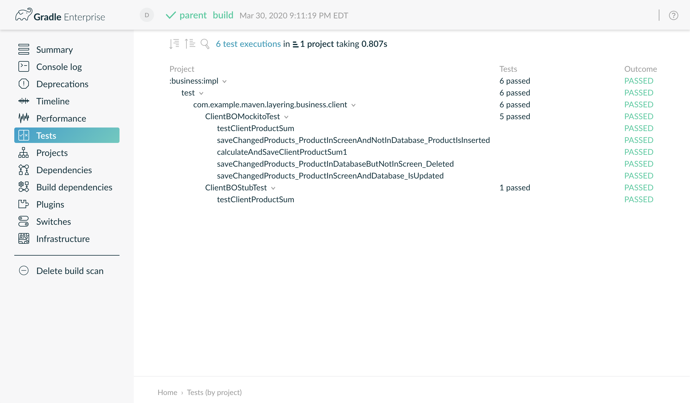

:idprefix:
:icons: font
:encoding: utf-8
:lang: en-US
:sectanchors: true
:sectlinks: true
:linkattrs: true
:jbake-permalink: maven-pom-dsl
:jbake-id: {jbake-permalink}
= Maven POM DSL
Daniel Lacasse
2020-04-01
:jbake-type: blog_post
:jbake-status: published
:jbake-tags: blog
:jbake-useroughviz: true
:jbake-description: Announcing the Maven Project Object Model (POM) DSL for Gradle.
:jbake-leadimage: maven-pom-dsl-logo.png
:jbake-leadimagealt: Maven Project Object Model DSL for Gradle logo
:jbake-twitter: { "creator": "@lacasseio", "card": "summary_large_image" }

After link:../hello-native[8 delusional years of thinking that Gradle can become the best build system on the planet] I realized that Maven is the way to go.
It has a simple DSL that everyone can gasp within minutes, unlike Gradle, with its fancy Groovy and Kotlin DSL.
A full Turing language for your build script is overrated.
Ant and Maven worked perfectly fine, why reinvent the wheel?
I'm proud to announce that our next big project at Nokee will be a Maven Project Object Model (POM) DSL footnote:[DSL stands for Domain Specific Language and, in the current context, refers to the language used for configuring your build.] support for Gradle.
It will ease your transition off Gradle toward Maven.
If you are a native developer, have a look at https://maven-nar.github.io/[NAR plugin for Maven].
It even supports cross-compilation, imagine that!

== How does it work?

Pretty much how you would expect it to work.
The plugin reads a standard `pom.xml` file and configures your Gradle build accordingly.
It's that simple.
Forget about the Groovy DSL or even the new, and fancy, Kotlin DSL.
Those are things of the past, long live the POM DSL.

IMPORTANT: Don't go on thinking that Gradle executes a full Maven instance inside the daemon... that would be pure madness.

I get it, you are a smart developer and want to know how Gradle will behave with this new (old?) DSL.
The following shows the `pom.xml` concept mapping to Gradle:

- *packaging*: The values `jar`, `ear`, and `war` map to the Gradle core plugins `java`, `ear`, and `war` respectively.
The plugin ignores all other packaging values.

- *modules*: The `pom.xml` files discovery starts from the root POM file, and they all participate in the https://docs.gradle.org/current/userguide/multi_project_builds.html[Gradle multi-project configuration].

- *properties*: The plugin maps the key/value pairs into the https://docs.gradle.org/current/dsl/org.gradle.api.plugins.ExtraPropertiesExtension.html[Gradle project's extra properties].

- *dependencies*: It maps each dependency scope to their equivalent Gradle configuration, i.e. `runtime` maps to `runtimeOnly`, `provided` maps to `compileOnly`, etc.
The plugin will also wire local project dependency as you would expect.
Finally, each dependency will be subject to the constraint imposed by the `dependencyManagement` tag.

- *parent*: During the configuration phase, it creates an effective POM by merging all the parent POM information for each project.

NOTE: The other informational tags, i.e. `name`, `inceptionYear`, `contributors`, etc., are simply copied over to the published POM.

== How to get started?

You can get started with those three easy steps:

1. Save the https://raw.githubusercontent.com/nokeedev/gradle-pom-dsl/master/pom.init.gradle[init script] to your `~/.gradle/init.d`.
footnote:[It is preferred to https://docs.gradle.org/current/userguide/command_line_interface.html#environment_options[specify the init script using the `--init-script` command line flag.]]
2. Huh, that is it... Only one step. Head over to the next section to see it in action.
3. I don't know, profit?
Why didn't you stop at the first step like everyone else?
I should have just said a single step... Sight, I not good at this.

From the command line, inside a POM DSL enabled project, simply execute Gradle as you would normally do:

[listing.terminal]
----
$ gradle assemble

BUILD SUCCESSFUL
2 actionable tasks: 2 executed
----

== What is supported?

I'm glad you asked, and the short answer is everything! footnote:[Some limitations apply. Batteries not included. Not recommended to use when it surpasses ten on the Richter scale.]
What? Don't you believe me?
Fair enough, let's go through some examples together.
Feel free to follow along.
We will be using https://github.com/nokeedev/gradle-pom-dsl/tree/master/src/docs/samples[these samples].
First things first, let's clone the repository:

// TODO: Complete this output
[listing.terminal]
----
$ git clone https://github.com/nokeedev/gradle-pom-dsl
...
$ cd gradle-pom-dsl/src/docs/samples
$ ls -1
1.basic-maven-example
2.intermediate-maven-example
3.multi-module-maven-example
README.adoc
----

=== Basic configuration? Check.

All the basic models, `artifactId`, `groupId`, `description`, `modules`, etc. are used for configuring the equivalent Gradle model.
We can see it in action using the `projects` tasks, as shown below:

[.listing.terminal]
----
$ cd 3.multi-module-maven-example
$ gradle projects

> Task :projects

------------------------------------------------------------
Root project - This pom acts as the parent pom for the entire project.
------------------------------------------------------------

Root project 'parent' - This pom acts as the parent pom for the entire project.
+--- Project ':business' - Business Layer Project.
|    +--- Project ':business:api' - Business Layer API.
|    \--- Project ':business:impl' - Business Implementation.
+--- Project ':data' - Sample Implementation of the Business Layer.
|    +--- Project ':data:api' - Data Access API.
|    \--- Project ':data:impl' - Data Access Implementation.
\--- Project ':model' - Model Layer Project.

To see a list of the tasks of a project, run gradle <project-path>:tasks
For example, try running gradle :business:tasks

BUILD SUCCESSFUL
1 actionable task: 1 executed
----

Did you see that?
The structure of the project, as well as the description, are pulled directly from the `pom.xml` files.
https://youtu.be/NSfBpXOzmd0?t=37[Unbelievable!]
What's next...

=== Dependency with exclusions? Check.

Do you need to exclude transitive dependencies?
Picture the following `pom.xml`:

[.listing]
----
<project xmlns="http://maven.apache.org/POM/4.0.0" xmlns:xsi="http://www.w3.org/2001/XMLSchema-instance"
   xsi:schemaLocation="http://maven.apache.org/POM/4.0.0 http://maven.apache.org/maven-v4_0_0.xsd">
   <modelVersion>4.0.0</modelVersion>
   <!-- ... -->

   <dependencies>
      <!-- ... -->

      <dependency>
         <groupId>org.hibernate</groupId>
         <artifactId>hibernate</artifactId>
         <version>3.2.5.ga</version>
         <exclusions>
            <exclusion>
               <groupId>javax.transaction</groupId>
               <artifactId>jta</artifactId>
            </exclusion>
         </exclusions>
      </dependency>
   </dependencies>

    <!-- ... -->
</project>
----

Pretty typical, right?
Now, let's see it in action:

[.listing.terminal]
----
$ cd ../2.intermediate-maven-example
$ gradle build --scan

BUILD SUCCESSFUL
4 actionable tasks: 4 executed

Publishing a build scan to scans.gradle.com requires accepting the Gradle Terms of Service defined at https://gradle.com/terms-of-service. Do you accept these terms? [yes, no] yes

Gradle Terms of Service accepted.

Publishing build scan...
https://gradle.com/s/hj73vryn73y74
----

Did I mention that https://scans.gradle.com/[build scans] also work?
Speaking of which, let's look at the dependency insight report.
We can see the artifact `javax.transaction:jta` wasn't pulled from Maven Central.

=== Multi module project with parent POM? Check.

So far, the features aren't that impressive.
How about a multi-module project with parent POM configuration?
The following example is exactly that:

[.listing.terminal]
----
$ cd ../3.multi-module-maven-example
$ gradle check --scan

BUILD SUCCESSFUL
11 actionable tasks: 11 executed

Publishing a build scan to scans.gradle.com requires accepting the Gradle Terms of Service defined at https://gradle.com/terms-of-service. Do you accept these terms? [yes, no] yes

Gradle Terms of Service accepted.

Publishing build scan...
https://gradle.com/s/tbul7lnihirto
----

Gradle reports all those tests in the build scan.
If you prefer, you can also look at the local reports generated by Gradle.

Are you impressed yet?
No?
What about...

=== Publishing? Check.

Publishing!
Everyone's favourite topic.
The POM DSL plugin automatically applies and configure the `maven-publish` plugin free of charge:

It publishes everything, see for yourself:

[.listing.terminal]
----
$ tree ~/.m2/repository
~/.m2/repository
└── com
    └── example
        └── maven
            └── layering
                ├── example-multi-module-business
                │   ├── 0.0.1-SNAPSHOT
                │   │   ├── example-multi-module-business-0.0.1-SNAPSHOT.pom
                │   │   └── maven-metadata-local.xml
                │   └── maven-metadata-local.xml
                ├── example-multi-module-business-api
                │   ├── 0.0.1-SNAPSHOT
                │   │   ├── example-multi-module-business-api-0.0.1-SNAPSHOT.jar
                │   │   ├── example-multi-module-business-api-0.0.1-SNAPSHOT.module
                │   │   ├── example-multi-module-business-api-0.0.1-SNAPSHOT.pom
                │   │   └── maven-metadata-local.xml
                │   └── maven-metadata-local.xml
                ├── example-multi-module-business-impl
                │   ├── 0.0.1-SNAPSHOT
                │   │   ├── example-multi-module-business-impl-0.0.1-SNAPSHOT.jar
                │   │   ├── example-multi-module-business-impl-0.0.1-SNAPSHOT.module
                │   │   ├── example-multi-module-business-impl-0.0.1-SNAPSHOT.pom
                │   │   └── maven-metadata-local.xml
                │   └── maven-metadata-local.xml
                ├── example-multi-module-data
                │   ├── 0.0.1-SNAPSHOT
                │   │   ├── example-multi-module-data-0.0.1-SNAPSHOT.pom
                │   │   └── maven-metadata-local.xml
                │   └── maven-metadata-local.xml
                ├── example-multi-module-data-api
                │   ├── 0.0.1-SNAPSHOT
                │   │   ├── example-multi-module-data-api-0.0.1-SNAPSHOT.jar
                │   │   ├── example-multi-module-data-api-0.0.1-SNAPSHOT.module
                │   │   ├── example-multi-module-data-api-0.0.1-SNAPSHOT.pom
                │   │   └── maven-metadata-local.xml
                │   └── maven-metadata-local.xml
                ├── example-multi-module-data-impl
                │   ├── 0.0.1-SNAPSHOT
                │   │   ├── example-multi-module-data-impl-0.0.1-SNAPSHOT.jar
                │   │   ├── example-multi-module-data-impl-0.0.1-SNAPSHOT.module
                │   │   ├── example-multi-module-data-impl-0.0.1-SNAPSHOT.pom
                │   │   └── maven-metadata-local.xml
                │   └── maven-metadata-local.xml
                ├── example-multi-module-model
                │   ├── 0.0.1-SNAPSHOT
                │   │   ├── example-multi-module-model-0.0.1-SNAPSHOT.jar
                │   │   ├── example-multi-module-model-0.0.1-SNAPSHOT.module
                │   │   ├── example-multi-module-model-0.0.1-SNAPSHOT.pom
                │   │   └── maven-metadata-local.xml
                │   └── maven-metadata-local.xml
                └── parent
                    ├── 0.0.1-SNAPSHOT
                    │   ├── maven-metadata-local.xml
                    │   └── parent-0.0.1-SNAPSHOT.pom
                    └── maven-metadata-local.xml

20 directories, 34 files
----

== But, why?

According to our in-depth study, the POM DSL is so simple to understand that it will give back over 9000 hours of R&D to your organization each week. footnote:[Disclaimer: Don't believe everything you read online.]
You heard me right.
Your developers can focus on what matters, like sending https://www.youtube.com/results?search_query=cat+videos[cat videos] or http://nyan.cat/[brag about their Nyan score] to each other.

== Wait! Wat?

That's not even a question.
Have you been following?
Maybe this cat picture using the POM DSL plugin will put you at ease.

== Convince me harder

I can surely try.
I had my team prepare a visual for your next meeting to help convince everyone:

[A plot of time saved versus number of additional feature developped]
++++

++++

Based on a study we did over the weekend, 1 out of 10 participants recommends the POM DSL over the current Groovy and Kotlin DSL.
Equally, we made the breakthrough discovery that you can't trust 9 people out of 10 that participated in the study, go figure.

== Conclusion

All kidding aside, Gradle is exceptionally flexible.
It always gets me when I hear "Gradle can't do X, Y or Z".
The truth of the matter being Gradle is the most flexible build system and possibly the only one you will ever need.

In the native ecosystem, the majority of developers strongly prefer Python for their scripting language.
Similarly, in the Web ecosystem, the developers strongly prefer Javascript (or it's variant).
Some developers go through great lengths for these preferences and create build systems with DSL that _feels_ like there preferred language.
However, I beg the question, which is more complicated:

- Creating a build system for a DSL; or
- Creating DSL for a build system?

I realized I could have faked the entire post; after all, it's April Fool day if you didn't know.
However, I built the entire POM DSL plugin and released the https://github.com/nokeedev/gradle-pom-dsl[source code on GitHub].
All samples shown in this post are real examples and work as demonstrated.
Feel free to toy around with the project and keep me posted on what you manage to accomplish.
This plugin is a demonstration, and you shouldn't use the plugin in production. footnote:[I don't guarantee its efficiency and don't believe it's bug-free.]

Stay safe and don't hesitate to link:#disqus_thread[leave a comment below] or ping me on the https://gradle-community.slack.com/[Gradle community Slack].
