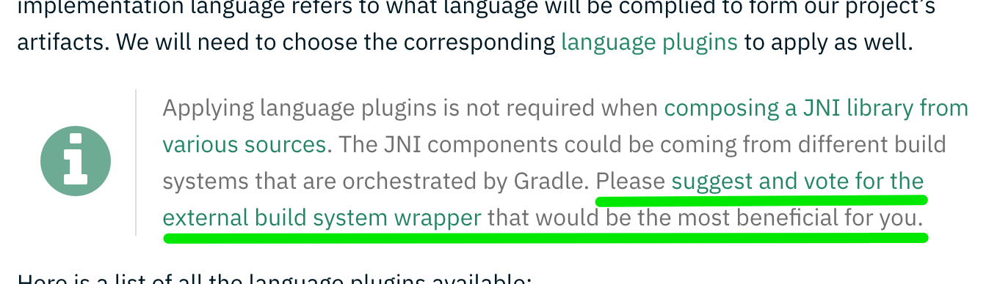

:idprefix:
:icons: font
:encoding: utf-8
:lang: en-US
:sectanchors: true
:sectlinks: true
:linkattrs: true
:jbake-permalink: release-0.3-announcement
:gradle-user-manual: https://docs.gradle.org/6.2.1/userguide
:gradle-language-reference: https://docs.gradle.org/6.2.1/dsl
:gradle-api-reference: https://docs.gradle.org/6.2.1/javadoc
:gradle-guides: https://guides.gradle.org/
:jbake-id: {jbake-permalink}
= Release 0.3 Announcement
Daniel Lacasse
2020-05-12
:jbake-type: blog_post
:jbake-status: published
:jbake-tags: blog
:jbake-description: Announcing release 0.3 of the Nokee plugin suite.
:jbake-leadimage: release-announcement-small.png
:jbake-leadimagealt: Release 0.3 announcement
:jbake-twitter: { "creator": "@lacasseio", "card": "summary_large_image" }

Join me in celebrating the link:/docs/0.3.0/release-notes.html[third release of the Nokee plugins].
The most significant announcement of this release is the early iOS support for Gradle.
Let's explore this announcement as well as the other improvement accomplished as part of this release.

== iOS Support for Gradle

Despite the link:../release-0.2-announcement[requirements express in the previous announcement road map for iOS support], I decided to work around them and deliver the first milestone.
I'm proud to show the fruit of that labour and deliver support for building iOS applications with XCTest for Gradle.
It's early support, which means there are limitations imposed by the plugin.
For example, the application will only execute inside the simulator running iOS 13.2.
The implementation language is also limited to Objective-C.
I purposefully limited the scope for this first release so I could focus on the core experience from the developer's perspective.
There are two main scenarios I wanted to cover.

The first scenario is building and launching the application from Xcode.
I carefully crafted the Xcode integration to delegate the build to Gradle while allowing Xcode to launch the application inside the simulator.
The experience aims to be as vanilla as possible.
It means you can build via `Product > Build` (Cmd+B) and launch the application via the main launch button, as shown in the video below.

// Open the application in Xcode IDE
// Auto completes work (jump to #include and to symbols)
// Build delegates to Gradle
// Launch app from Xcode
image::xcode-ide-launch-action.gif[Launch iOS application inside simulator from Xcode IDE,align=center]

The second scenario is testing from Xcode.
This scenario is probably the most tricky to get right.
The integration allows tests to be executed via the main test button in the top left corner, from the test navigator or the side dot in the editor.
You can see it in action in the video below.

// XCTest support integration in Xcode IDE (no command line launching in this release)
// In Xcode, launch test via the dot or the test navigator.
// UI Test works as well.
image::xcode-ide-test-action.gif[Execute iOS XCTest inside simulator from Xcode IDE,align=center]

For both scenarios, the integration needed to allow indexing to work as expected.
Developers can jump to symbol definitions, jump to files from an `#import` directive and perform searches inside the symbol navigator.

image::xcode-ide-indexing.gif[Navigate between symbols inside Xcode IDE,align=center]

Feel free to link:/docs/0.3.0/samples/#sec:ios[try out one of the samples].
If you find any issues, please link:https://github.com/nokeedev/gradle-native/issues[open an issue].
Don't hesitate to contact me at hello@nokee.dev if you want to help sponsor the effort.
We can work together and deliver the use case that would have the highest impact on your developer productivity first.

== Java Native Interface (JNI) development improvement

The JNI library plugin kept improving during this release.
I worked with the team behind link:https://github.com/weisJ/darklaf/pull/154[Darklaf to showcase the JNI library plugin on their project].
I identified gaps in the API resolving mostly around accessing variants, binaries and their tasks.
I took this opportunity to add new APIs to allow a smoother transition.

A special thanks to link:https://github.com/javenwang[Javen Wang] for his help in enabling to link:/docs/0.3.0/samples/kotlin-cpp-jni-library[use Kotlin as a JVM language with the JNI library plugin].

Finally, I also rolled out an entire link:/docs/0.3.0/manual/building-jni-projects.html[chapter on explaining building JNI projects with Gradle and the Nokee plugins].

== Documentation improvement

On the documentation front, I wrote additional chapters to explain the link:/docs/0.3.0/manual/plugin-anatomy.html[anatomy of Nokee plugins], link:/docs/0.3.0/manual/building-jni-projects.html[building JNI projects] and link:/docs/0.3.0/manual/developing-with-xcode-ide.html[developing with Xcode IDE].
I also wrote link:/docs/0.3.0/manual/plugin-references.html[reference chapters for all the new plugins] as well as link:/docs/0.3.0/samples/[new samples covering additional use cases raised by the community].

When I started my Gradle journey in 2012, I found the build language documentation (also known as DSL reference) precious to my learning.
To honour this great resource, I wrote the automation required to generate the link:/docs/0.3.0/dsl[build language reference for all public types of the Nokee plugins].

As I take documentation very seriously, it is essential to note that I consider unclear documentation as a bug.
If you encounter any issue with the documentation, please link:https://github.com/nokeedev/gradle-native/issues[open an issue], so we can improve it for everyone.

== Testing improvement

On the testing front, I added automated tests to keep the Nokee plugins in sync with Gradle release cycles.
With this new addition, we are closer to the 1.0 milestone.
I notice some gaps in the testing coverage during the last development cycle.
They will be closed in the next release so we can move forward with the 1.0 release!

== Open polls

Sometimes I don't have enough context to make a decision that would have the most impact.
For this reason, I like working with teams to help drive the requirements forward.
The key point is about gathering information to make clear technical decisions.
I started to create link:https://github.com/nokeedev/gradle-native/labels/a%3Apoll[poll issues that ask open-ended questions for everyone to participate].
The result of those polls will help drive the Nokee plugins forward with features that you care about.
I scattered links to the polls across the documentation contextualize them.

Feel completely free to provide your opinion on each one of them.
I will be using those issues as guidelines for what to work on next.
For this reason, specific and tangible use cases are the key point I'm looking for.

== What's Next?

I'm scheduling improvements to toolchain support, in particular, the toolchain selection for the next release.
This work is a fundamental feature that will help the cross-compiling stories with Gradle.
It will be beneficial for iOS support as well as open opportunities for native Android support.
It's also essential to support dependencies and iOS libraries.
CocoaPods is a must for the success of the iOS development support in Gradle.
Luckily, the flexibility of Gradle will enable all these features over the next few releases of the Nokee plugins.

Don't hesitate to link:#disqus_thread[leave a comment below] or ping me on the https://gradle-community.slack.com/[Gradle community Slack].
If you want to work with me and drive the iOS support for Gradle forward with your team, send me an email at hello@nokee.dev.
